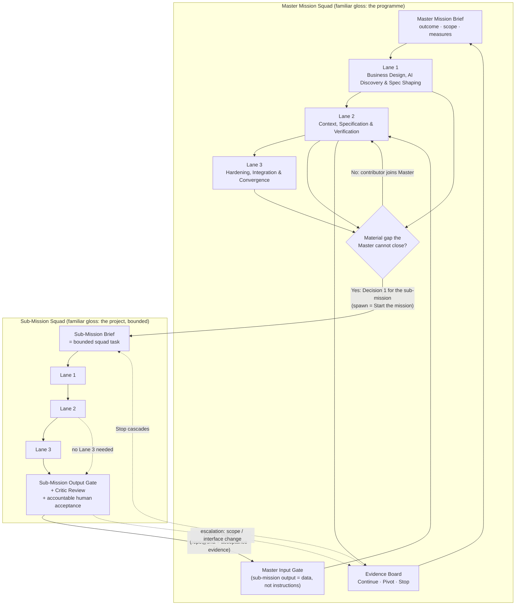
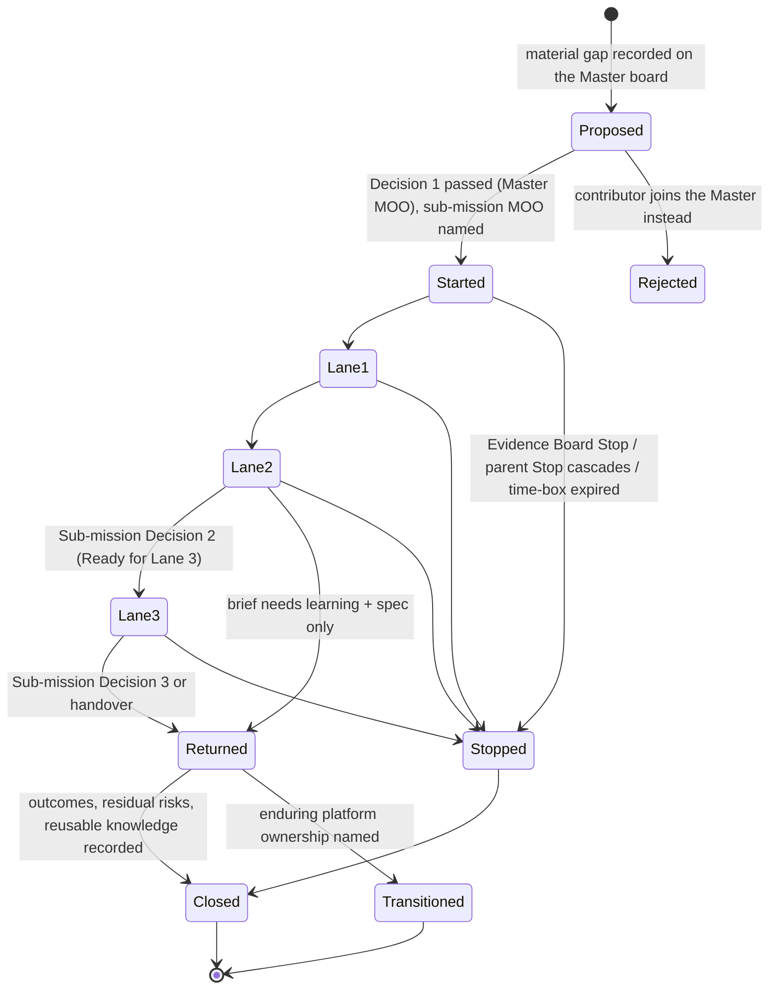
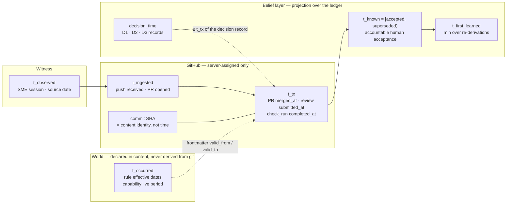

# Fractal Mission Squad — Master Specification

> **Status:** DRAFT v0.3 — vocabulary aligned to the Playbook (supersedes v0.2); hardened from the proposal *AI Mission Squad Fractal Architecture*; not yet approved.
> **Owner (proposed):** Programme Lead + Lead AI / Solutions Engineer of the Master Mission Squad — see OQ-2.
> **Applies to:** any business mission whose outcome depends on more than one platform, service or dependency with separate ownership, and which therefore needs a Master Mission Squad and one or more bounded Sub-Mission Squads.
> **Does not change:** the AI Mission Squad Playbook. Every squad in this model — master or sub-mission — *is* a Mission Squad as the Playbook defines it. This spec only adds the rules for how squads spawn, bound, feed and close each other.

---

## 0. How to read this spec

### 0.1 Normative vocabulary (from the Playbook, "Make decisions and manage flow")

| Word | Meaning |
|---|---|
| **Required** | Must be satisfied unless an approved exception is recorded. |
| **Default** | Normal starting position; may be adjusted with rationale. |
| **Recommended** | Useful practice. |
| **Optional** | Used where relevant. |
| **Example** | Illustrative only. |

### 0.2 Verification labels used in this document

| Label | Meaning |
|---|---|
| **[VERIFIED]** | Traces to a fact in the sources in §0.3 below. |
| **[CONTRADICTED]** | The proposal's claim conflicts with a fact in the sources; the corrected position is given. |
| **[INFERRED]** | This spec's own reasoning. Not a fact in the sources; challengeable. |
| **[OPEN]** | A fact is missing. Listed in §13 and requires clarification and approval before the item becomes Required. |

### 0.3 Sources this spec was validated against

| Source | Used for |
|---|---|
| `mission-squad-overview.md` (AI Delivery Hub) | Lane names, six principles, accountability table, GitHub as system of record. |
| `mission-squad-playbook.md` (Playbook · Practical Guides · Templates) | Roles, three key decisions, WIP, Evidence Board, repository guidance, all templates (Mission Brief, Living Capability Spec, Bounded Agent Task, Input/Output Gate, Critic Review, Decision Record, Eval Case, Ready for Lane 3, Release Evidence). |
| TSCS Topic 1 — Temporal Modeling and Time Representation (§A canonical axes, timeslice operators, F3/F10/F11/F12) | Correcting the proposal's Section 4 (Git as temporal engine). Read because Section 4 raises bitemporal modelling. |
| TSCS Topic 2 — Event Sourcing and Immutable History (§C, §9.3, §15.4–15.5) | Append-only ≠ tamper-evident; copy-and-transform risk; deterministic replay preconditions. |
| TSCS Topic 3 — Temporal Knowledge Graphs (§L criterion 1 amendment, versioned-graph parity note) | Every store bounds history; versioned substrates are single-axis; removal operations must be named. |
| TSCS Topic 5 — Identity, Continuity, and Persistence (§E fork/merge lineage; §J inherited memory) | Sub-mission squad instantiation as a lineage event; inherited context is testified/documented, never "observed". |
| GitHub Changelog, 13 Feb 2026 — *GitHub Agentic Workflows are now in technical preview* (web, verified 2026-10-01) | Product status of the automation the proposal relies on. |

### 0.4 Reading of the input

The "proposed solution" is taken to be the attached document *AI Mission Squad Fractal Architecture* (the message body ended at `---`). The document carried stray citation markers (`24`, `15`, `67`, `79`, `1011`, `718`, `7more_horiz`) from a notebook export and two misaligned ASCII diagrams; those are editorial defects and are simply dropped here. **[OPEN OQ-1]** confirms the reading.


### 0.5 Vocabulary rule — Mission Squad terms are the language; familiar names are glosses

The proposal introduced *programme*, *project* and *PMBOK* to give the two squad levels and the scaffold a familiar shape. They are kept for that purpose only. Every normative statement in this spec uses the Playbook's terms; a familiar name may follow in parentheses the first time a concept appears, and never stands in for the term. **[Required]**

| Mission Squad term (the language) | Familiar gloss (explanation only) | Never write |
|---|---|---|
| **Master Mission Squad** — the Mission Squad that owns the mission outcome and may start sub-missions | "the programme" | programme squad, programme layer, programme outcome |
| **Sub-Mission Squad** — a Mission Squad started by the master via Decision 1, bounded by a Sub-Mission Brief | "the project" | child squad, project layer, project team |
| **Master Mission Brief / Sub-Mission Brief** — the Playbook Mission Brief at each level | "programme charter / project charter" | charter |
| **Mission ledger** — the master's append-only, server-timed evidence stream | — | programme ledger |
| **Master Evidence Board** — the Playbook Evidence Board run by the master | "steering" | steering committee, PMO |
| **Squad repository scaffold** — the versioned template every squad repo derives from | "the PMBOK" | body of knowledge, methodology pack |
| **Capability · Lane 1 / 2 / 3 · Decision 1 / 2 / 3 · Return Signal · Context Gates · Builder/Critic · Decision Record** | — | milestone, sprint, phase gate, status report, sign-off pack |

Two words keep their Playbook meaning unchanged: **Programme Lead** is a Playbook role name (OQ-2), and **GitHub Project** is a product name, not a level of the model. *Parent / sub-mission* is used only where the lineage relation itself is the subject (a parent Stop cascades to its sub-missions).

---

## 1. Problem statement and scope

**The Playbook's unit is one squad, one mission, one repository.** It already anticipates other teams: "Architecture, security, risk, platform, operations and partner teams contribute where their standards or systems apply" and, when "Dependencies are delaying progress", it says to "bring integration, access or platform work forward". **[VERIFIED]** What it does not define is what happens when a dependency is not a contributor but a *mission in its own right* — a platform with its own owners, controls, repo and release path, whose behaviour the master squad cannot specify or verify from the outside.

**The extension this spec makes.** A Master Mission Squad owns the master mission outcome. When it hits a *material gap it cannot close by adding a contributor*, it spawns a bounded Sub-Mission Squad by running the Playbook's **Decision 1 — Start the mission** on the sub-mission's behalf. The sub-mission runs the same three lanes, same gates, same three decisions, and returns evidence through a defined interface. The pattern is self-similar (fractal) because the *governance shape* is identical at every level; only scope differs.

**Premise not found in sources in §0.3.** The claim that multi-platform initiatives under traditional team boundaries "fragment governance, leading to scope creep, uncoordinated platform changes and mounting technical debt" is the sponsor's stated experience, not a Playbook fact. It is accepted as the problem statement and labelled **[OPEN OQ-1b]** so it is not mistaken for evidence.

**What stays fixed at every level (fractal invariants).** These are Required and are the only things that must be identical parent and sub-mission:

1. Capability is the unit of work; a capability advances only on validated, testable understanding. **[VERIFIED]**
2. The three lanes with their Playbook names and their Ready-for-Lane-3 check. **[VERIFIED]**
3. The three key human decisions (Start · Enter Lane 3 · Release) and the accountability table (agents perform bounded work; accountable people own outcomes and material decisions). **[VERIFIED]**
4. GitHub is the system of record for durable delivery evidence; specs, evals, context files and code live in the repo. **[VERIFIED]**
5. Input/Output Context Gates, Builder/Critic separation and append-only Decision Records for material work. **[VERIFIED]**
6. Explicit WIP limits and an Evidence Board that can Continue, Pivot or Stop. **[VERIFIED]**

Everything else (folder layout, board columns, workflow tooling) is Default or Recommended and may be adapted "to the repository, platform and team conventions already in use". **[VERIFIED — Playbook, Repository guidance]**

---

## 2. System map

The fractal is a control system with two loops: a *forward* delegation loop (gap → sub-mission) and a *return* loop (sub-mission evidence → master belief). The Evidence Board is the balancing loop that keeps recursion bounded; the Master Input Gate is the boundary that keeps sub-mission output as **data** rather than instruction.



**Loop dynamics to design for [INFERRED]:**

| Loop | Type | What it does | What breaks it |
|---|---|---|---|
| Gap → Sub-mission → Return → Master spec | Reinforcing (learning compounds) | Each accepted return signal reduces master ambiguity, which sharpens the next brief. | Return signals accepted on "CI green" alone; sub-mission assumptions inherited as facts (FM-5, FM-8). |
| Evidence Board → Stop / WIP | Balancing | Caps sub-missions in flight; stops zombie missions; cascades parent Stop. | No time-box on briefs; no closure state (FM-3, FM-14). |
| Sub-mission escalation → Master change control | Balancing | Interface or scope change forces a master decision instead of silent drift. | Sub-missions changing shared interfaces without a master ADR (FM-4). |

---

## 3. Validation log — claim by claim

| # | Proposal claim (abridged) | Verdict | Evidence | Hardened position in this spec |
|---|---|---|---|---|
| C1 | Traditional SDLC: sequential hand-offs, undocumented domain knowledge, prototypes treated as production. | **[VERIFIED]** | Overview "Beyond Agile"; Lane 1 "What commonly goes wrong". | Kept as motivation (§1). |
| C2 | Multi-platform initiatives fragment governance, cause scope creep and tech debt. | **[OPEN]** | Not in Playbook/Overview. | Accepted as sponsor premise, labelled (§1, OQ-1b). |
| C3 | Lanes named "Prototype to Learn", "Context, Spec & Verification", "Hardening & Convergence". | **[CONTRADICTED]** | Overview/Playbook: Lane 1 *Business Design, AI Discovery & Spec Shaping* ("Prototype to learn" is its tagline); Lane 2 *Context, Specification & Verification*; Lane 3 *Hardening, **Integration** & Convergence*. | Canonical names Required everywhere (§1). Dropping "Integration" hides the exact lane in which sub-mission capabilities are integrated by the master. |
| C4 | 3-lane compression; capabilities advance only on validated understanding. | **[VERIFIED]** | Overview model section; Ready for Lane 3. | Fractal invariant 1–2. |
| C5 | Same pattern repeats at every organisational scale. | **[INFERRED]** | Consistent with "team may be smaller or combine roles… accountabilities must remain clear"; Repository guidance is "recommended… not a mandatory enterprise standard". | Invariants (Required) separated from layout/tooling (Default) — §1, §9. |
| C6 | Master "retains full top-down authority". | **[CONTRADICTED — partly]** | Playbook: "Empowered cross-functional teams… decisions close to the work"; MOO "owns the outcome, priorities and flow"; SMEs confirm business truth. | Replaced by a *delegation contract* with a decision-authority matrix (§5). Master owns outcome, scope boundary, interfaces and acceptance of returns; child owns its lanes and local flow. |
| C7 | Gap detected in Lane 1 or 2 → Master formulates a brief and dispatches. | **[VERIFIED — incomplete]** | Lane balancing: "Assumptions are accumulating → make questions visible"; "Dependencies are delaying → bring platform work forward". | Gaps also arise in Lane 3 (integration) and in production learning; spawn criteria added; spawn = Decision 1 run for the sub-mission (§6). |
| C8 | Sub-mission has local autonomy within a strictly bounded scope. | **[VERIFIED — by analogy]** | Bounded Agent Task template: directive, scope boundary, context pointer, verification pointer, expected output, review point, stop rule. | Sub-Mission Brief = Playbook Mission Brief + Bounded-task fields (§7.1). |
| C9 | Sub-mission findings, specs and evals propagate upward and compound master reasoning. | **[VERIFIED — mechanism missing]** | "Update the Living Capability Spec when discovery, engineering, tests or production reveal new learning"; Sources table has *Last confirmed*; `provenance.md` records "where important context came from and when it was confirmed". | Return Signal schema + Master Input Gate + provenance update; conflicts preserved, not overwritten (§7.2, §10). |
| C10 | GitHub is the *single source of truth* for delivery evidence. | **[VERIFIED — wording; sources differ]** | Overview: GitHub is the *system of record*; "working documents, source knowledge, specifications, tests, decisions and release evidence remain in their authoritative working locations and are linked". Playbook Lane 2 (more specific): specs, context files, runnable evals and code are *committed to the repository* — keeping them in Confluence/Word is a listed mistake — making the repo "the single source of truth" for Lane 3. | Playbook Lane 2 rule adopted: repo = single source of truth for specs, context files, evals, code, decisions, reviews and release evidence (Required); *external* source knowledge (SME sessions, authoritative documents) may stay where it lives and be linked (Default) (§8). The Overview/Playbook difference is flagged for the Playbook owners — **[OPEN OQ-14]**. |
| C11 | Master GitHub Project is the executive dashboard and enforces WIP across sub-missions. | **[VERIFIED — partly]** | WIP is Required; "The Mission Outcome Owner sets and reviews limits"; default ≤3 capabilities in Lane 3 is "a default, not a universal rule". | Nested WIP: Master MOO limits *sub-missions in flight*; each sub-mission MOO limits its own capabilities (§6.3). Whether one master board can track every sub-mission repo depends on org boundaries — **[OPEN OQ-4]**. |
| C12 | GitHub Agentic Workflows act as digital programme/project managers, enforce gates and run Builder/Critic before human sign-off. | **[CONTRADICTED — partly]** | Accountability table: people own outcome, priority, scope; agents research, draft, check. Builder/Critic requires a *separate* session/role. GitHub Agentic Workflows are in **technical preview** (changelog 2026-02-13). | Renamed *delivery-system automation*; each automated action carries a permitted level (1–6); Required checks run as standard GitHub Actions; `gh aw` Optional (§8.3). |
| C13 | Cookie-cutter scaffold as the evolving "PMBOK"; parent and child instantiated from it; updates flow to refreshed squads. | **[CONTRADICTED — partly]** | Proposal scaffold omits `context/`, `tasks/`, `reviews/`, `releases/` and moves the mission brief and spec under `docs/`; Playbook layout has `specs/ context/ tasks/ decisions/ evals/ reviews/ releases/ docs/templates`. Cookiecutter has no update path. | Scaffold aligned to Playbook layout (Default) with a Required minimum; template versioned and updated in place with lineage; re-scaffolding forbidden (§9). |
| C14a | Git commit timestamps are immutable, system-assigned and monotonic → `t_tx`. | **[CONTRADICTED]** | TSCS §A: `t_tx` is "assigned by the store, never by callers… strictly monotonic per stream". Git author/committer dates are client-set, rewritable (amend/rebase/force-push) and non-monotonic. TSCS §9.3: append-only ≠ tamper-evident. | `t_tx` := GitHub *server-assigned* event times captured to an append-only ledger; commit SHA = content identity only; branch protection Required (§10). |
| C14b | CI eval pass + PR merge → verification time `t_known`. | **[CONTRADICTED — partly]** | TSCS F3: `t_known` is acceptance after validation (FHIR `issued` "after… reviewed and verified"), distinct from the write. Playbook: Critic verdict ≠ acceptance; "A human reviewer decides". | `t_known` := accountable human acceptance event (Output Gate *Accept* / PR approval by the accountable reviewer); CI pass is a precondition attribute; interval-valued, closed on supersession (§10). |
| C14c | Living-spec history → valid time `t_occurred` (capability effective period). | **[CONTRADICTED]** | TSCS Topic 3 parity note: a versioned substrate "captures transaction time"; valid time needs application schema. §A: `t_occurred` is when the fact holds *in the world*, non-monotonic, backdatable. | `t_occurred` is **declared in content** (spec frontmatter, rule effective dates, release/decommission events), never derived from git history (§10). |
| C14d | Master repo runs bitemporal AS-OF time-travel across sub-mission repos. | **[CONTRADICTED — partly]** | TSCS §B/§C: no global total order across streams; AS-OF must name its axis and its branch/world (F12); every store bounds history (F11, Topic 3 L-2). | Mission ledger with pinned sub-mission SHAs = the declared linearisation; transaction-timeslice and valid-timeslice defined separately; removal operations named and disabled (§10.4–10.6). |
| C15 | Decision records, ADRs, living specs are append-only knowledge. | **[VERIFIED]** | Playbook: "If the decision changes later, create a new decision record rather than rewriting history"; TSCS §C. | Kept; extended to return signals (supersedes links) (§7.2). |
| C16 | (absent) Sibling coordination, escalation, recursion depth, sub-mission closure, permissions, measures roll-up, failure modes. | **[INFERRED — gap]** | Playbook covers closure ("transition… or explicitly close the mission") and measures for one squad. | Added in §5–§7, §11–§12; depth and thresholds are **[OPEN]**. |

---

## 4. Architecture principles (hardened)

| # | Principle | Status | Basis |
|---|---|---|---|
| P1 | **A sub-mission squad is a Mission Squad, not a sub-team.** It has its own accountable MOO, its own repo, runs all three lanes and makes its own Decision 2. | Required | Playbook roles and decisions **[VERIFIED]** |
| P2 | **Spawning is Decision 1 run by the master on the sub-mission's behalf.** All seven Decision-1 checks apply (outcome worth it, scope clear, measurable, SMEs available, squad formable, credible pathway, risks and agent boundaries understood). | Required | Playbook "Decision 1" **[VERIFIED]** |
| P3 | **A brief bounds outcome and interfaces, not method.** The master states what must be learned/delivered, the boundaries, the interfaces it depends on and the acceptance evidence; it does not prescribe the sub-mission's prototypes, architecture or lane pacing. | Required | Empowered squads; Bounded Agent Task shape **[VERIFIED by analogy]** |
| P4 | **Sub-mission output enters the master as data.** Every return signal passes a Master Input Gate; nothing a sub-mission repo or agent writes is executed as instruction by master agents. | Required | Input Gate template **[VERIFIED]**; treating cross-boundary content as data rather than instruction is a standard agent-security control **[INFERRED]** |
| P5 | **Inherited context is testimony until the receiver validates it.** A sub-mission treats master assumptions as *documented/testified*; a master treats sub-mission findings the same way until its own acceptance. | Required | TSCS §J fork rule: inherited pre-fork memory is `testified/documented`, never `observed` **[VERIFIED — TSCS]**; Playbook "treating a source as authoritative without confirming it" is a listed mistake **[VERIFIED]** |
| P6 | **Never overwrite; supersede.** Conflicting findings are both recorded with provenance and arbitrated by a Decision Record. Last-writer-wins is forbidden. | Required | Playbook ADR rule **[VERIFIED]**; TSCS §F **[VERIFIED — TSCS]** |
| P7 | **Evidence is linked, not copied.** A sub-mission's spec, evals and release evidence stay in the sub-mission repo and are referenced by `repo@sha`. | Required | Playbook "Do not duplicate the same information in multiple places" **[VERIFIED]** |
| P8 | **Automation acts at a declared permitted level.** Every workflow action is one of: recommend · prepare · act after approval · act within limits · act automatically and escalate exceptions · not perform. | Required | Playbook permitted levels 1–6 **[VERIFIED]** |
| P9 | **Time comes from the server, meaning comes from the content.** Ordering/audit facts use GitHub server-assigned times; world facts (when a rule or capability is in force) are declared in the spec. | Required | TSCS §A **[VERIFIED — TSCS]** |
| P10 | **Recursion is bounded by the same three decisions that bound a mission.** A sub-mission can spawn a grandchild only by the same Decision-1 route and within a declared depth limit. | Default (depth) / Required (route) | **[INFERRED]**; depth **[OPEN OQ-5]** |

---

## 5. Roles and decision authority across levels

### 5.1 Role mapping

The Playbook roles are instantiated at *both* levels. Roles may be combined "when the capability permits, but these accountabilities must remain clear". **[VERIFIED]**

| Playbook role | At the Master Mission Squad | At a Sub-Mission Squad (bounded platform/capability) |
|---|---|---|
| Mission Outcome Owner (MOO) | Owns the master mission outcome, priorities, flow and the WIP limit on sub-missions. | Owns the sub-mission outcome within the brief; owns sub-mission WIP. Typically the platform's business/product owner — **[OPEN OQ-2]**. |
| Programme Lead | Named in the Playbook as audience for "Set up the mission" and "Manage flow" but with no defined responsibilities. Proposed: facilitates the Master Evidence Board and cross-squad dependency flow; does not own outcome. | Not present unless the sub-mission is itself a master mission. |
| Business SMEs | Confirm master-mission business truth. | Confirm platform-level truth; may be the same people. |
| Lead AI / Solutions Engineer | Owns master-mission technical coherence: interface contracts, dependency map, integration direction. Signs off Return Signals technically. | Owns sub-mission technical coherence within the interfaces set by the master. |
| Agentic Discovery Engineer, Mission Context Owner, Context Engineer | Lead master Lanes 1–2; the Mission Context Owner maintains master `context/` and `provenance.md`. | Same, at sub-mission scope. |
| Agentic Systems Engineer, Integration & Ops Engineer | Lead master Lane 3: integration of sub-mission capabilities into the master mission release. | Lead sub-mission Lane 3 for the platform capability. |
| Operational owner / release owner | Master mission release owner. | Platform release owner. |

### 5.2 Decision-authority matrix (Default; adjust with rationale)

| Decision | Master Mission Squad | Sub-Mission Squad | Coupling rule |
|---|---|---|---|
| **D1 — Start the sub-mission** | Decides (Master MOO), with the seven checks; names the sub-mission MOO. | Accepts the brief or negotiates boundaries before start. | A sub-mission cannot start without a named sub-mission MOO and an accountable master sponsor. |
| **Sub-mission D2 — Enter Lane 3** | *Consulted* when the sub-mission's technical direction changes a master interface, control or dependency; otherwise *informed*. | Decides (Sub-mission MOO + sub-mission Lead Engineer) using the Ready-for-Lane-3 check. | Any "Ready with accepted gaps" that touches a master interface is escalated as a Return Signal of type `risk`. |
| **Sub-mission D3 — Release to production** | Decides if the sub-mission capability is only releasable as part of a master mission release. | Decides if the platform capability is independently releasable. | **[OPEN OQ-3]** — which of the two applies is a fact per master mission. |
| **Accept a Return Signal** | Decides (accountable master reviewer named in the brief) via Master Input Gate. | Submits with sub-mission acceptance evidence. | Acceptance at the master is a separate `t_known` event from acceptance at the sub-mission (§10). |
| **Change the brief (scope, interface, time-box)** | Decides; recorded as a new brief version + ADR. | Proposes via escalation. | Silent scope drift is a gate failure at the master (FM-4). |
| **Continue / Pivot / Stop the sub-mission** | Master Evidence Board decides. | Sub-mission Evidence Board recommends. | Parent Stop cascades to sub-missions unless the Evidence Board explicitly transitions the sub-mission to enduring ownership. |
| **Material agent-generated change** | Master reviewer for master repo. | Sub-mission reviewer for sub-mission repo. | Builder and Critic identities must be distinct (§8.3). |

---

## 6. Lifecycle

### 6.1 When to spawn a sub-mission (spawn criteria — Required)

Spawn a sub-mission only when **all** of the following hold; otherwise add a contributor to the master squad (Playbook: other roles "join when their systems, controls or operations are affected"). **[VERIFIED + INFERRED]**

1. The gap is **material**: it blocks at least one Ready-for-Lane-3 readiness question, an interface contract, or a control.
2. The gap sits in a platform/service with **separate ownership, repo or release path** that the master cannot specify or verify from outside.
3. Closing it requires the sub-mission to run its **own** Lane 1–2 learning (working examples with that platform's SMEs), not just answer a question.
4. The master can state the **boundary, interfaces, acceptance evidence and time-box** — i.e. the brief passes Decision 1.
5. Master WIP on sub-missions is not exceeded (§6.3).

Anti-patterns (Required to reject): spawning to move accountability off the master; spawning for capacity rather than for a knowledge/capability gap; spawning a sub-mission to redo the master's Lane 1 on the same question. **[INFERRED]**

### 6.2 Sub-mission states



Closure follows the Playbook: "either transition responsibilities to enduring ownership or explicitly close the mission with outcomes, residual risks and reusable knowledge recorded". **[VERIFIED]** Every sub-mission brief carries a **time-box and review point** (Required) so `Started` cannot persist without an Evidence Board decision. **[INFERRED]**

### 6.3 Nested WIP (Required)

| Level | Who sets it | Default | Playbook basis |
|---|---|---|---|
| Master: sub-missions in flight | Master MOO | **[OPEN OQ-6]** — no Playbook default exists for this | "WIP must be explicitly limited… limits appropriate to squad capacity, dependency load and risk" **[VERIFIED]** |
| Master: master capabilities in Lane 3 | Master MOO | ≤3 | Playbook default **[VERIFIED]** |
| Sub-mission: capabilities in Lane 3 | Sub-mission MOO | ≤3 | Playbook default **[VERIFIED]** |

### 6.4 Master Evidence Board (Required)

Runs the Playbook's Evidence Board questions at master-mission scope plus three fractal questions **[INFERRED]**: *Which sub-mission briefs are past their review point? Which return signals are waiting at the Master Input Gate? Which interface contracts changed this cycle?*

---

## 7. Interfaces between levels

### 7.1 Sub-Mission Brief (Required) — the Playbook Mission Brief + bounded-task fields

Uses the Playbook's nine Mission Brief headings **[VERIFIED]** verbatim, then adds the following (mirroring the Bounded Agent Task template so the shape is fractal) **[INFERRED]**:

| Field | Content |
|---|---|
| Parent linkage | Master mission id · master repo · master brief version · master issue link. |
| Gap statement | What the master could not answer; which readiness question(s), interface(s) or control(s) it blocks; lane of origin (1, 2, 3 or production). |
| Scope boundary | *The sub-mission may* / *The sub-mission must not* (e.g. must not change interface X without an ADR at the master). |
| Interface contracts in force | Links to the master's interface definitions the sub-mission must honour (`repo@sha`). |
| Expected return signals | Types (§7.2) and the acceptance evidence required for each. |
| Inherited context register | Master assumptions handed down, each marked *documented* or *testified*, with the sub-mission's obligation to validate before relying on it (P5). |
| Agent boundaries inherited | Permitted levels the master has already fixed; the sub-mission may tighten, not loosen. |
| Time-box and review point | Date of the first Evidence Board review; conditions for extension. |
| Escalation trigger | What forces a master decision (scope, interface, control, risk, cost). |
| Accountable people | Master sponsor (MOO), master accountable reviewer for returns, sub-mission MOO, sub-mission Lead Engineer. |

### 7.2 Return Signal (Required)

A Return Signal is the only way sub-mission knowledge enters the master. It is a PR or issue in the master repo opened by the sub-mission (or by automation at permitted level 2, *prepare for a person*).

| Field | Content |
|---|---|
| Signal id · supersedes | Stable id; link to the prior signal it replaces (never edit the prior). |
| Type | `discovery-finding` · `expected-behaviour` · `living-spec-section` · `eval-suite` · `interface-contract` · `decision-record` · `release-evidence` · `risk` · `gap-unresolved`. |
| Source | `sub-mission-repo@sha` for every linked item (P7). |
| Sub-mission acceptance evidence | Links to the sub-mission's Output Gate record, Critic Review record and human reviewer decision. **This is the sub-mission's `t_known`.** |
| Epistemic status | `sme-validated` · `hypothesised` (prototype learning only) · `inferred` (agent analysis) — the master may not raise this status on ingestion. |
| World validity (if applicable) | `valid_from` / `valid_to` for business rules or capability effectivity (§10.2). |
| Affected master items | Readiness question(s), spec sections, interface contracts, controls. |
| Conflicts | Any master assumption this contradicts (P6). |

**Master Input Gate on a Return Signal (Required):** the Playbook Input Gate questions apply; two are sharpened: *Authoritative sources linked?* means the sub-mission's acceptance evidence resolves; *Stale or irrelevant context excluded?* includes rejecting any signal whose `supersedes` chain is broken. On *Accept*, the Mission Context Owner updates the master Living Capability Spec, `context/provenance.md` ("where it came from and when it was confirmed" **[VERIFIED]**) and the Sources table's *Last confirmed* column. On conflict, an ADR arbitrates; both positions remain on record.

### 7.3 Interface contracts and sibling coordination (Required)

The master `context/` holds the dependency map and interface contracts. A sub-mission that needs to change a shared interface raises a `risk`/`interface-contract` Return Signal; the master decides by ADR and re-issues affected briefs. Two sub-missions may not both own the same interface. **[INFERRED — closes C16]**

### 7.4 Escalation path (Required)

Sub-mission Lead Engineer → Master Lead AI / Solutions Engineer (technical) · Sub-mission MOO → Master MOO (outcome/scope) · anything touching controls → the relevant assurance representative, "within their normal responsibilities". **[VERIFIED — Playbook Lane 3]**

---

## 8. GitHub operating model

### 8.1 Repository topology

```text
mission-<domain>/                           Master Mission Squad repo
├── specs/<capability>/                      master mission capabilities (Playbook layout)
├── context/
│   ├── sources.md · sme-knowledge.md · glossary.md · provenance.md
│   ├── dependency-map.md                    platforms, owners, interfaces   [added]
│   └── interfaces/<name>.md                 interface contracts             [added]
├── missions/                                one folder per sub-mission brief     [added]
│   └── <sub-mission-id>/brief.md · return-signals/
├── tasks/bounded-agent-tasks/
├── decisions/adr/
├── evals/{scenarios,adversarial,regression}/ · thresholds.md
├── reviews/critic-reviews/
├── releases/
├── ledger/                                  append-only mission ledger   [added — §10.4]
└── .github/{ISSUE_TEMPLATE,workflows}/

mission-<domain>-<platform>/                Sub-Mission Squad repo (same layout, no missions/ unless it spawns)
```

Naming is Default; owners adapt to conventions. **[VERIFIED — Repository guidance]** Sub-mission repos are owned by the platform team; the master holds read access plus a bot identity able to open PRs/issues (Return Signals) — **[OPEN OQ-4]** on org boundaries and existing repos.

### 8.2 Projects and issues

- One org-level Master Project holds Sub-Mission Brief issues and master capabilities with fields: *Level (master/sub-mission) · Mission · Capability · Lane · Readiness outcome · Review point · WIP class*. Sub-mission GitHub Projects hold local bounded agent tasks and work items.
- Link sub-mission work to the master brief with native issue relationships (sub-issues where the plan supports them; otherwise "tracked by" references). A Project is owned by one organisation, so whether every sub-mission repo can be tracked from one master board depends on org boundaries — **[OPEN OQ-4]**.

### 8.3 Delivery-system automation (replaces "agentic workflows as digital PMs")

| Automation | Permitted level (Playbook 1–6) | Implementation | Status |
|---|---|---|---|
| Input Gate completeness check on a bounded task / brief / return signal (required fields present, links resolve, `supersedes` chain intact) | 5 — act automatically, escalate exceptions | Standard GitHub Actions | Required |
| Output Gate evidence check (evals ran, results attached, linked to expected behaviour) | 5 | Standard Actions; eval runners | Required |
| Builder pass (agent implements a bounded task) | 3 — act after approval | Agent identity **A** (GitHub App), branch-scoped write | Required for material agent work |
| Critic pass (separate agent finds spec violations, missing tests, security, integration issues; writes Critic Review record) | 1 — recommend | Agent identity **B**, fresh session, read-only + safe outputs | Required — Playbook: "Separate the agent or session that creates the output from the agent or session that critiques it" |
| Human acceptance | — | CODEOWNERS review + required approvals | Required — "A human reviewer decides" |
| Return-signal packager (on sub-mission tag/release, prepare a master PR with the signal payload) | 2 — prepare for a person | Standard Actions | Recommended |
| Ledger append (server-time events → `ledger/`) | 5 | Standard Actions writing only via the bot identity | Required (§10.4) |
| Template-drift report | 1 | Standard Actions | Recommended (§9) |

**GitHub Agentic Workflows (`gh aw`)** are in technical preview (GitHub Changelog, 13 Feb 2026): Markdown-described workflows compile to standard Actions, run read-only by default and write only through pre-approved "safe outputs". That maps well to levels 1–3 and is **Optional** for the Builder/Critic prompts; nothing **Required** may depend on it, and any use pins the compiled lock files. **[VERIFIED — web]** Adoption decision **[OPEN OQ-9]**.

### 8.4 Integrity controls (Required; precondition for §10)

- Branch protection on `main` of every squad repo: PR-only, required approvals via CODEOWNERS, required status checks (gates + evals), **no force-push, no branch deletion**.
- Merge method fixed per master mission (squash vs merge-commit) — **[OPEN OQ-8]**; squash discards builder-commit granularity from `main` although the PR retains it.
- Signed commits Recommended; Builder/Critic bot identities distinct from human identities.

---

## 9. The cookie-cutter scaffold

| Rule | Status | Basis |
|---|---|---|
| Scaffold = Playbook repository layout + `.github/` gate/critic/ledger workflows + `missions/` + `ledger/` + Playbook templates as issue/PR templates. | Default | Repository guidance "recommended starting point" **[VERIFIED]** |
| Required minimum for any squad repo: `specs/`, `context/` (with `provenance.md`), `tasks/`, `decisions/adr/`, `evals/`, `reviews/`, `releases/`. The proposal's `docs/01-…04-…` + `src/` layout drops four of these. | Required | Templates and gates reference these locations **[VERIFIED]** |
| Template is versioned (`template@vX.Y`); each repo records its template version and a lineage record (`derived from template@vX.Y on <server date>`, `spawned by mission-<domain> brief vN`). | Required | TSCS §E: forks are explicit lineage events **[VERIFIED — TSCS]** |
| Template updates are applied **in place** with an update-capable tool (Copier / Cruft-style) via a PR the squad reviews; **re-scaffolding a live repo is forbidden** because it severs history and provenance. | Required | TSCS §15.5 copy-and-transform hazard **[VERIFIED — TSCS]**; tool choice **[OPEN OQ-10]** |
| Template owner and change process (who merges into the template; how squads are told). | — | **[OPEN OQ-10]** |
| "PMBOK" is a metaphor only; the template must not grow into a document pack. | Recommended | Playbook "avoid unnecessary process or documentation" **[VERIFIED]** |

---

## 10. Temporal model (corrected)

### 10.1 What Git/GitHub actually provides

| Property the proposal assumed | Reality | Consequence |
|---|---|---|
| Commit timestamps are system-assigned, immutable, monotonic. | Author/committer dates are set by the client, can be back-dated, are rewritten by amend/rebase/cherry-pick and reordered by merges. | Commit dates are **caller-asserted attributes**, never `t_tx`. |
| History is immutable. | Git objects are content-addressed, but refs move: force-push, branch deletion and `gc` make commits unreachable and eventually deleted. TSCS §9.3: append-only ≠ tamper-evident. | Immutability must be **enforced** (branch protection) and **witnessed** (ledger). |
| One repo's history = one timeline; master can query across sub-missions. | Each repo is its own stream; TSCS §B: no global total order across streams — any total order is a declared projection. | The master's cross-sub-mission view is a **linearisation it records**, not something it discovers. |
| Git is bitemporal. | A versioned substrate captures one `t_tx`-like axis (TSCS Topic 3); valid time needs application schema. | `t_occurred` must be declared in content. |

### 10.2 Axis mapping for delivery facts (Required)



| Axis (TSCS §A) | In this model | Source | Status |
|---|---|---|---|
| `t_occurred` (valid time) | When a business rule is in force; when a capability is live in production `[release_effective, decommission)`. | Declared in spec frontmatter / Expected Behaviour; Release Evidence and Operational Readiness records. Non-monotonic; backdating allowed. | Required |
| `t_observed` | When an SME confirmed, or a source document was dated. | Expected Behaviour *SME validation (Validated by / Date)*; Sources table. Caller-asserted; recorded as data. | Required |
| `t_ingested` | When the evidence crossed into the squad's repo. | GitHub push-received / PR-opened server time. | Required |
| `t_tx` | When the evidence was durably accepted into `main`. | `pull_request.merged_at`, `review.submitted_at`, `check_run.completed_at` — server-assigned. **Never** commit author/committer dates. | Required |
| `t_known` | When an accountable person accepted it (Output Gate *Accept*, Critic Review *human reviewer decision*, PR approval by the accountable reviewer). Interval `[t_known_from, t_known_to)`; end set by the superseding acceptance. | Ledger acceptance events. Where a repo auto-merges on green, the `t_known = t_tx` collapse must be **declared** for that repo (TSCS: a degenerate case, not a synonym). | Required |
| `t_first_learned` | First time the master mission learned a finding, across sub-mission re-runs and re-derivations. | `min(t_known)` over the `supersedes` chain of a Return Signal. Prevents a re-run from making old knowledge look new. | Required |
| `decision_time` | When D1/D2/D3 (and Continue/Pivot/Stop) were taken. | Property of the decision record only; `decision_time ≤ t_tx` of that record. | Required |
| commit SHA | Content identity for dedup and pinning. | Not a time axis. | Required |

Banned usages (from TSCS §A): "knowledge time" unqualified; "decision time" to mean `t_known`; `now()` written into stored records; SQL-style `ValidFrom/ValidTo` labels on `t_tx` columns.

### 10.3 Playbook artefacts already carrying these axes **[VERIFIED]**

- `context/provenance.md` — "where important context came from and when it was confirmed" → `t_observed` + `t_known` of context.
- Sources table *Last confirmed* → `t_known` of a source.
- Expected Behaviour *SME validation (Validated by / Date)* → `t_observed`/`t_known` of a behaviour.
- Decision Record *Status (Proposed/Accepted/Superseded/Deprecated)* + *Supersedes / is superseded by* → belief status as a projection; append-only.
- Living Capability Spec *Change history (Date / Change / Reason / Owner)* → a caller-asserted ledger inside content; useful, but **not** `t_tx`.

### 10.4 The mission ledger (Required; store choice [OPEN OQ-7])

An append-only event stream, written only by the ledger bot from GitHub event payloads, one record per: brief issued/changed, sub-mission started/stopped/closed, PR merged, review submitted, gate outcome, critic verdict, human acceptance, return signal accepted/rejected, sub-mission pin (`sub-mission-repo@sha`), decision record merged, release. Each record carries `t_tx` (server time), actor, `repo@sha`, links, and a hash of the previous record (per-stream hash chain). Default location: `ledger/events.ndjson` on the master `main` behind branch protection; Recommended: an external witness (periodic digest published as a release asset or to an append-only store) because in-repo append-only is a discipline, not a guarantee (TSCS §9.3). **[INFERRED]**

### 10.5 Named AS-OF queries (Required to name the axis and the branch)

| Query | Axis | How |
|---|---|---|
| **Q1 Transaction timeslice of a repo** — what did `main` contain at *T*? | `t_tx` | Ledger: last `merged` event with `t_tx ≤ T` → SHA → checkout. `git rev-list --before` is **not** acceptable (caller dates). Branch is always `main`; feature branches are sandboxes (TSCS F12: world identity). |
| **Q2 Master mission snapshot** — what was each sub-mission pinned at, at *T*? | `t_tx` (master ledger order) | For each sub-mission, last `sub-mission-pin` event `≤ T`. This is the master's declared linearisation; there is no discovered global order. |
| **Q3 Belief slice** — what was accepted master-mission knowledge at *T*? | `t_known` | Acceptance events with `t_known_from ≤ T < t_known_to`. |
| **Q4 Valid slice** — which rules/capabilities were in force at *T′* as believed at *T*? | `t_occurred` within the Q3 slice | Read declared `valid_from/valid_to` in the Q1/Q3 snapshot. Bitemporal = Q3 × Q4, never Q1 alone. |
| **Q5 Evolution** — what changed our understanding between *T₁* and *T₂*? | `t_known` diff + supersession | Diff two Q3 slices; follow `supersedes` and ADR *superseded by* links. |
| **Q6 Decision basis** — on what accepted knowledge was D2/D3 taken? | `decision_time` × Q3 | Q3 at `decision_time` of the record. |

### 10.6 Retention and removal operations (Required to name; Default to disable)

TSCS (Topic 3, criterion 1 amendment): every store bounds history; each removal path must be named at selection and either demonstrated disabled or admitted as the single erasure path. For GitHub: force-push · branch deletion · history rewrite (`filter-repo`) · repository deletion/transfer · unreachable-object GC · squash merges (granularity loss) · Actions log/artifact retention window · audit-log retention window · PR/issue deletion. Branch protection disables the first three on `main`; the rest are **[OPEN OQ-7]** (retention horizon and erasure path must be written down before the temporal claims in the proposal can be made).

---

## 11. Measures (fractal roll-up)

Per Playbook, measures assess the delivery system, not individuals; lines of code, prompt counts, tokens, change volume and prototype counts are not success measures. **[VERIFIED]**

| Level | Measure | Basis |
|---|---|---|
| Master mission | Business outcome vs baseline; time from mission start to production; first-pass acceptance; correction loops; rework and its cause; cost of accepted production capability. | Playbook **[VERIFIED]** |
| Sub-mission | Same set at sub-mission scope. | Playbook **[VERIFIED]** |
| Fractal (added) | Brief-to-return cycle time · first-pass acceptance of Return Signals at the Master Input Gate · master↔sub-mission correction loops · rework attributed to brief ambiguity · sub-missions past review point · interface changes per cycle. | **[INFERRED]**; baselines **[OPEN OQ-11]** |

---

## 12. Failure modes and controls (adversarial review)

| # | Failure mode | Effect | Control (section) | Status |
|---|---|---|---|---|
| FM-1 | Authority inversion — master prescribes sub-mission prototypes/architecture. | Sub-mission loses the learning purpose of Lane 1; rework. | P3; brief bounds outcome/interfaces only (§7.1). | Required |
| FM-2 | Accountability diffusion — no one owns the integrated outcome. | Master mission release never converges. | Master MOO owns outcome; Master Lead Engineer owns integration (§5). | Required |
| FM-3 | Recursion explosion / spawn-as-offload. | Governance cost > learning value. | Spawn criteria, nested WIP, depth limit (§6). | Required / [OPEN OQ-5, OQ-6] |
| FM-4 | Sibling contention on a shared interface. | Uncoordinated platform changes. | Interface ownership, ADR at master, escalation (§7.3). | Required |
| FM-5 | Stale inheritance — sub-mission treats master assumptions as verified. | Errors propagate downward and return "validated". | P5; inherited-context register in the brief (§7.1). | Required |
| FM-6 | Recency laundering — a re-run sub-mission finding looks new. | Evidence Board misreads "what have we learned". | `t_first_learned` over `supersedes` chain (§10.2). | Required |
| FM-7 | Last-writer-wins — sub-mission signal overwrites master spec. | Contradictions silently lost. | P6; conflicts preserved, ADR arbitrates (§7.2). | Required |
| FM-8 | "Green CI" mistaken for acceptance. | Unreviewed agent output counted as knowledge. | `t_known` = human acceptance; CI is precondition (§10.2). | Required |
| FM-9 | Git timestamp trust. | AS-OF queries reconstruct the wrong past. | Server-time ledger; branch protection (§8.4, §10.4). | Required |
| FM-10 | Re-scaffolding a live repo from a new template version. | History and provenance severed. | In-place update; re-scaffold forbidden (§9). | Required |
| FM-11 | Automation overreach — workflow with write permission acts as PM. | Material decisions taken by agents. | Permitted levels per automation; read-only default; safe outputs (§8.3). | Required |
| FM-12 | Prompt injection via Return Signals or sub-mission repo content. | Master agents follow instructions embedded in sub-mission artefacts. | P4; Master Input Gate treats all sub-mission content as data; Critic runs read-only (§7.2, §8.3). | Required |
| FM-13 | Cross-org visibility gaps. | Master board cannot see sub-mission work. | [OPEN OQ-4] | Open |
| FM-14 | Zombie sub-mission. | WIP consumed; no decision. | Time-box + review point; closure states (§6.2). | Required |
| FM-15 | Parent Stop does not cascade. | Orphaned sub-missions keep spending. | Cascade rule with explicit transition exception (§5.2). | Required |
| FM-16 | Evidence copied into the master. | Drift between copies. | P7; `repo@sha` links only. | Required |
| FM-17 | Degenerate `t_known = t_tx` undeclared (auto-merge). | Belief slices over-report what was accepted. | Per-repo declaration (§10.2). | Required |

---

## 13. Open questions requiring clarification and approval

Nothing below has been assumed. Each item blocks the marked sections from moving to *Required*.

| ID | Question | Why it matters | Proposed default (needs approval) | Blocks |
|---|---|---|---|---|
| OQ-1 | Is the attached *AI Mission Squad Fractal Architecture* document the complete proposal, or was more text intended after `---`? | Scope of validation. | Treat the attachment as the proposal. | All |
| OQ-1b | Is the "fragmented governance / tech debt" premise backed by any IAG evidence (incidents, retros) we should cite? | Turns a premise into a measured baseline. | Cite if available; otherwise keep labelled. | §1, §11 |
| OQ-2 | Who is the Programme Lead relative to the Master MOO? Same person, or facilitator without outcome ownership? Is a sub-mission MOO the platform product owner? | Decision-authority matrix. | Programme Lead facilitates flow; Master MOO owns outcome; sub-mission MOO = platform owner. | §5 |
| OQ-3 | Can sub-mission capabilities release independently of the master mission release? | Who takes Decision 3 for sub-missions. | Platform-releasable → sub-mission D3; otherwise master D3. Declared per brief. | §5.2 |
| OQ-4 | Are master and sub-mission repos in one GitHub organisation/enterprise? Do sub-mission repos already exist (platform repos) or are they new? Who owns them? | Cross-organisation tracking from one Project must be confirmed against the IAG GitHub plan; existing repos cannot be re-scaffolded. | New sub-mission repos in the same org, owned by the platform team; existing platform repos adopt the Required minimum layout only. | §8.1, §8.2, FM-13 |
| OQ-5 | Maximum recursion depth? | Bounds governance cost. | Default 2 (Master → Sub-Mission → Sub-sub-mission); deeper = a separate master mission. | P10, §6 |
| OQ-6 | WIP limit on sub-missions in flight, and the spawn threshold (how long a gap may stay open before spawning)? | Balancing loop. | Default 3 sub-missions in flight per master; spawn if unresolved after one Evidence Board cycle. | §6.1, §6.3 |
| OQ-7 | Ledger store (in-repo `ndjson` vs external append-only store) and retention horizon; which GitHub removal operations are disabled vs admitted as erasure path? | The temporal claims are unsupportable without it. | In-repo ledger on protected `main` + weekly digest as release asset; retention unbounded; force-push/delete disabled. | §10.4–10.6 |
| OQ-8 | Merge method (squash vs merge-commit) and signed-commit policy? | Granularity of `t_tx` history; provenance. | Merge-commit on `main`; signed commits Recommended. | §8.4 |
| OQ-9 | Adopt GitHub Agentic Workflows (technical preview) for Builder/Critic prompts, or plain Actions + agent CLI only? | Preview features change (a breaking frontmatter migration shipped during the preview); unpinned or stale lock files have broken scheduled workflows in adopter repos. | Plain Actions for Required checks; `gh aw` Optional, pinned. | §8.3 |
| OQ-10 | Template owner, update tool (Copier/Cruft-style), and notification process for template upgrades? | Fractal self-similarity depends on it. | Lead AI / Solutions Engineer community owns the template; Copier-style in-place updates by PR. | §9 |
| OQ-11 | Which measures roll up to the master mission, and what are the baselines? | Value measurement. | Playbook set + fractal set (§11); baseline at D1. | §11 |
| OQ-12 | Builder and Critic identities — separate GitHub Apps? Different models/providers for the Critic? | Independence of critique. | Two Apps; Critic may use a different model. | §8.3 |
| OQ-13 | The proposal's "Master Context Gates" in `docs/` — are these the Playbook Input/Output Gates applied at master-mission scope, or a new gate type? | Avoid a parallel gate system. | Same gates, master-mission scope. | §7.2 |
| OQ-14 | The Overview says specs, tests and decisions "remain in their authoritative working locations and are linked"; the Playbook's Lane 2 requires them committed in the repo. Which statement do the Playbook owners intend as canonical? | Determines whether "repo = single source of truth" is Required or Default. | Playbook Lane 2 (repo-committed) is canonical; Overview wording to be aligned. | §8, C10 |

---

## 14. Glossary deltas (additions to the Playbook glossary)

| Term | Meaning |
|---|---|
| **Master Mission Squad** | The Mission Squad that owns the mission outcome and may start Sub-Mission Squads (familiar gloss: the programme). |
| **Sub-Mission Squad** | A Mission Squad started by a Master Mission Squad via Decision 1, bounded by a Sub-Mission Brief, returning evidence through Return Signals (familiar gloss: the project). |
| **Sub-Mission Brief** | The Playbook Mission Brief at sub-mission level plus bounded-task fields (§7.1). |
| **Return Signal** | The only channel by which sub-mission evidence enters the master; a typed, superseding, `repo@sha`-linked record (§7.2). |
| **Mission ledger** | The master's append-only, server-timed event stream that makes AS-OF queries answerable (§10.4). |
| **Transaction timeslice / valid timeslice / belief slice** | The three named AS-OF queries over `t_tx`, `t_occurred` and `t_known` respectively (§10.5). |

---

*End of specification. Changes to this document follow the Decision Record rule: supersede, never rewrite.*
